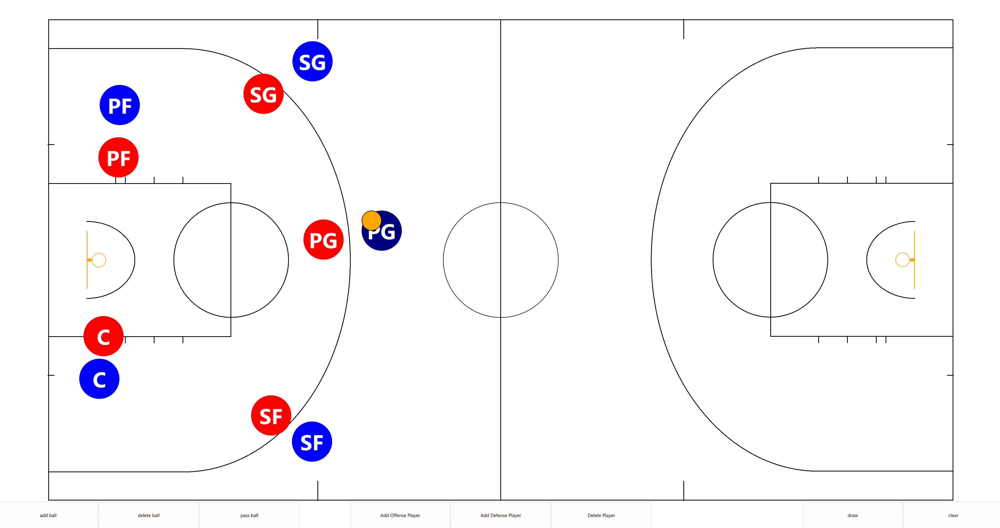

# Basketball Play Animation/Visualizer

## Interactive 2D basketball plays animation and coaching board built with Qt/QML

This project is an interactive basketball coaching board to make plays easier to draw and animate. 
It allows you to place players on a court, add a ball, and simulate passing between players.
A coaching board in desktop and mobile devices in the future. 

## Features
- Court, player and ball scale relative to the screen.
- Add/Delete offensive and defensive players.
- A canvas that can let you draw plays on the court.
- Add/Delete basketball on the court.
- Animate ball passes between players

## How to run this project
- Clone repository
- Install [Qt](https://www.qt.io/download-dev)
- Open project in Qt Creator
- Build and run by clicking the run button in Qt Creator

## Future improvements
- Save and run plays
- Mobile device support